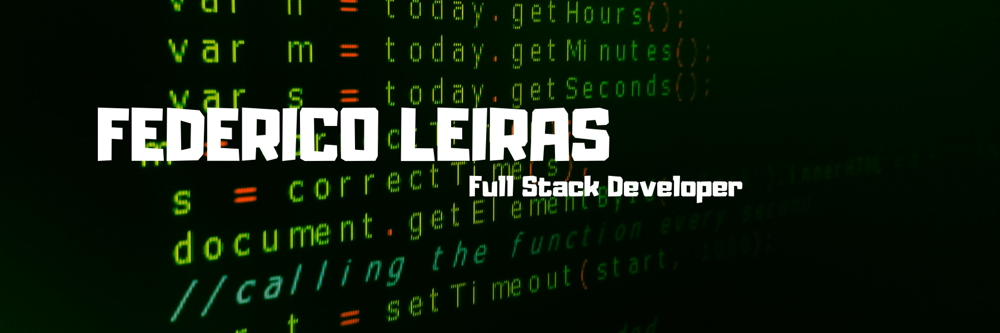

# Hola, soy Federico 👨🏻‍💻

<h4 align="center">🧑Soy un <b>Desarrollador Full Stack apasionado por el mundo de la programación</b>, me gusta poder crear soluciones que marquen la diferencia, siempre estoy dispuesto a seguir capacitándome en el área que se requiera. Doy gran importancia a mi capacidad para trabajar en equipo, generar confianza y aprender de los demás.</h4>

<h2> Linkedin:</h2>

<h2 align="center">Idiomas y herramientas:</h2>

  

<a href="https://redux.js.org" target="_blank"> 

 
 

 
 

