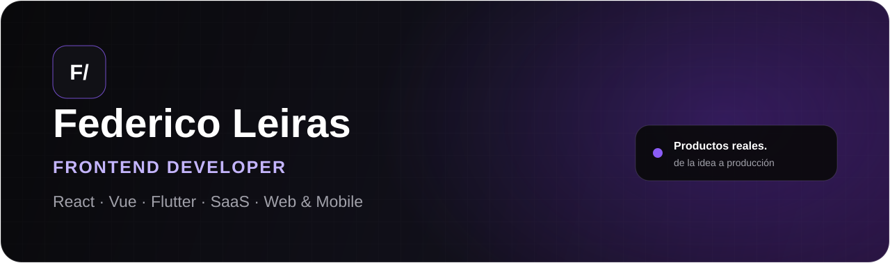

  

  <strong>Frontend Developer · React · Vue · Flutter · SaaS · Web & Mobile</strong>

  <a href="https://www.linkedin.com/in/fede-leiras">LinkedIn</a>
  &nbsp;·&nbsp;
  <a href="mailto:fleiras18@gmail.com">Email</a>
  &nbsp;·&nbsp;
  <code>Portfolio · Próximamente</code>

<!-- Portfolio: cuando esté publicado, reemplazar el texto anterior por un enlace a la URL definitiva. -->

## Sobre mí

Soy **Frontend Developer con más de 3 años de experiencia profesional**, construyendo productos SaaS y aplicaciones web/mobile utilizadas en entornos productivos.

Trabajo principalmente con **React, Vue y Flutter**. Tengo experiencia desarrollando flujos de autenticación, dashboards administrativos, gestión de usuarios y roles, integraciones con APIs REST, WebSockets y funcionalidades en tiempo real. También cuento con experiencia backend con **Node.js, Express y PostgreSQL**, lo que me permite entender el producto más allá de la interfaz.

A lo largo de mi recorrido profesional evolucioné de **Fullstack Developer Trainee → Frontend Developer JR → Frontend Developer SSR** en EXO S.A., participando también en definición de arquitectura frontend, estimaciones técnicas y desarrollo de MVPs desde cero hasta producción.

Actualmente desarrollo proyectos freelance para web y mobile, involucrándome desde la necesidad inicial hasta la implementación y puesta en producción.

Me interesa especialmente construir productos **mantenibles, rápidos, responsive y simples de usar**, cuidando arquitectura, performance, calidad de código y experiencia de usuario.

- 💼 Última experiencia en relación de dependencia: **Frontend Developer SSR — EXO S.A.**
- 🚀 Actualmente: **desarrollo freelance de productos web y mobile**
- 🎓 Ingeniería en Informática — **Universidad Nacional Arturo Jauretche**
- 📍 Buenos Aires, Argentina

## Stack tecnológico

| Área | Tecnologías |
| --- | --- |
| **Frontend** | React · Vue 3 · JavaScript · TypeScript · HTML · CSS |
| **Mobile** | Flutter · Dart |
| **State Management** | Redux · Pinia · Riverpod |
| **Backend & Data** | Node.js · Express · PostgreSQL |
| **Integraciones** | REST APIs · WebSockets · Real-time features |
| **Herramientas** | Git · Docker · CI/CD |
| **Forma de trabajo** | Scrum · Kanban · Testing · Documentación |

## Proyectos destacados

<table>
  <tr>
    <td width="50%" valign="top">
      <h3>⚔️ WoW Latinoamérica</h3>
      
Plataforma web para una comunidad latinoamericana de World of Warcraft. Desarrollo frontend e integración con la API existente desarrollada en Laravel.

      
<strong>React · JavaScript · Laravel API</strong>

      
<a href="https://www.wowlatinoamerica.com/"><strong>Ver proyecto →</strong></a>

    </td>
    <td width="50%" valign="top">
      <h3>💬 WLA Chat</h3>
      
Aplicación mobile multiplataforma para el ecosistema WLA, orientada a usuarios autenticados, personajes y comunicación de la comunidad.

      
<strong>Flutter · Dart · REST · Real-time</strong>

      
<em>El caso de estudio estará disponible en mi portfolio.</em>

    </td>
  </tr>
  <tr>
    <td width="50%" valign="top">
      <h3>✨ Soy Luz</h3>
      
Sitio web freelance responsive, diseñado para comunicar servicios con una experiencia clara, cálida y accesible.

      
<strong>Frontend · Responsive UI · Freelance</strong>

      
<a href="https://soy-luz.netlify.app/"><strong>Ver proyecto →</strong></a>

    </td>
    <td width="50%" valign="top">
      <h3>🧘 Ale Pilates Mat</h3>
      
Landing page moderna y responsive enfocada en presentar clases de Pilates y facilitar el contacto con potenciales alumnos.

      
<strong>React · Tailwind CSS · Netlify</strong>

      
<a href="https://alepilatesmat.netlify.app/"><strong>Ver proyecto →</strong></a>

    </td>
  </tr>
</table>

## Experiencia en producto

Mi trabajo no se limita a maquetar interfaces. A lo largo de mi experiencia participé en distintas etapas del desarrollo de producto:

- **Arquitectura frontend** y organización de aplicaciones mantenibles.
- Desarrollo de **interfaces responsive** a partir de diseños y requerimientos de producto.
- **Autenticación, usuarios y roles** en plataformas multiusuario.
- Integración de **APIs REST y WebSockets** para funcionalidades en tiempo real.
- Desarrollo de **dashboards administrativos** y herramientas de gestión.
- **Performance, UX y mejora continua** sobre productos en producción.
- Desarrollo de **MVPs desde cero** hasta su salida a producción.

## GitHub

Uso GitHub como parte de mi trabajo diario y como espacio para mantener proyectos personales y freelance. No todos los productos en los que trabajé profesionalmente son públicos, por lo que mi actividad visible representa solo una parte de mi experiencia.

  <a href="https://github.com/FLeiras?tab=repositories"><strong>Explorar mis repositorios</strong></a>
  &nbsp;·&nbsp;
  <a href="https://github.com/FLeiras?tab=overview"><strong>Ver actividad</strong></a>

## Contacto

Si querés conversar sobre **desarrollo frontend, productos digitales, proyectos freelance u oportunidades profesionales**, podés contactarme por:

  <a href="mailto:fleiras18@gmail.com"><strong>Email</strong></a>
  &nbsp;·&nbsp;
  <a href="https://www.linkedin.com/in/fede-leiras"><strong>LinkedIn</strong></a>
  &nbsp;·&nbsp;
  <code>Portfolio · Próximamente</code>

<!-- Portfolio deploy pendiente. Agregar aquí la URL definitiva cuando esté disponible. -->
